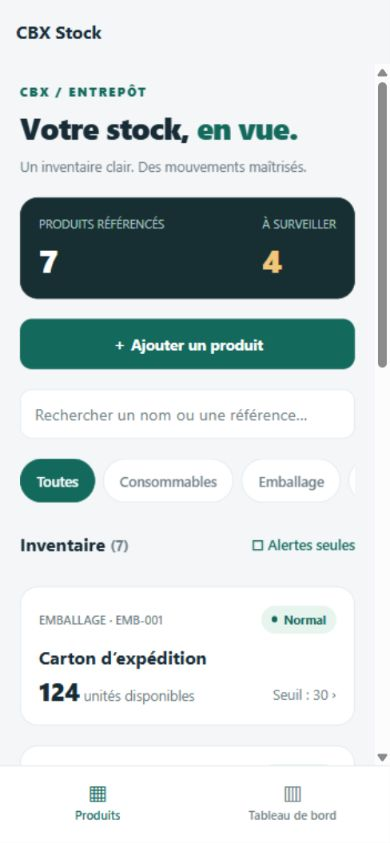
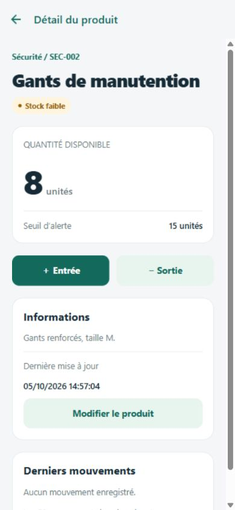
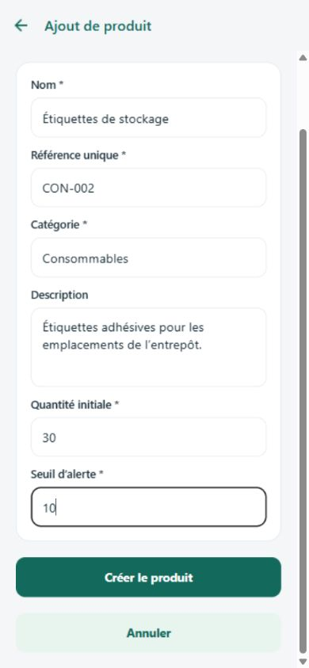
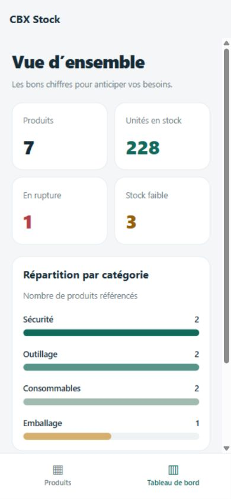

# CBX Stock — gestion de stock mobile

Application React Native en TypeScript pour un entrepôt fictif. Les données sont servies par une véritable API Express et conservées dans une base SQLite dédiée, côté serveur. Aucun stockage local ne simule le backend.

## Lancer le projet

Prérequis : **Node.js 24 LTS**, npm et Expo Go compatible SDK 57 sur le téléphone. Aucun compte cloud, Docker, clé API ou fichier `.env` n’est nécessaire.

```bash
git clone https://github.com/Shyamsundar0606/cbx-stock-management.git
cd cbx-stock-management
npm ci
npx expo start
```

`npm ci` installe aussi le backend. `npx expo start` démarre automatiquement l’API sur le port **3000**, initialise SQLite et insère six produits d’exemple au premier lancement. Scanner le QR code avec Expo Go. Le téléphone et l’ordinateur doivent être sur le **même réseau local**, et les ports 3000 et 8081 doivent être accessibles depuis le téléphone. L’adresse de l’API est déduite de l’hôte Expo : pas d’adresse IP à modifier dans le code.

Dans le terminal Expo : `a` ouvre Android (émulateur installé), `i` ouvre iOS (macOS et simulateur requis), `w` ouvre l’aperçu web. Pour démarrer directement le web :

```bash
npm run web
```

En cas d’API inaccessible, vérifier que le serveur affiche `Stock API: http://localhost:3000`, que les appareils sont sur le même réseau et que le pare-feu autorise les connexions locales. Le mode `--tunnel` d’Expo ne publie pas l’API : utiliser le réseau local ou une API distante configurée explicitement.

## Fonctionnalités

- Inventaire avec nom, référence, catégorie, quantité, seuil et badge textuel/coloré.
- Recherche par nom ou référence, filtre par catégorie et filtre « Alertes seules ».
- Détail avec description, date de mise à jour, entrées/sorties et historique des 50 derniers mouvements.
- Création et modification avec validation des champs obligatoires, références uniques et nombres entiers.
- Tableau de bord : nombre de produits, unités, ruptures, stock faible et graphique par catégorie.
- Chargement, listes vides, erreurs réseau, nouvelle tentative et actualisation par glissement.
- Boutons d’au moins 44 points et libellés d’accessibilité. Formulaires défilants avec adaptation au clavier iOS.

**États :** normal si quantité > seuil ; faible si 0 < quantité ≤ seuil ; rupture si quantité = 0. Le compteur des alertes regroupe faible et rupture ; le tableau de bord les compte séparément.

Les quantités et seuils acceptent les entiers de 0 à 1 000 000. Un mouvement doit être strictement positif ; une sortie supérieure au stock reçoit une erreur sans aucune modification. Les corrections de quantité via le formulaire modifient l’inventaire directement ; utiliser les mouvements pour tracer une entrée ou sortie.

## Captures

Captures réelles de l’aperçu React Native Web à **390 × 844**, après vérification des parcours. Le produit « Étiquettes de stockage » a été ajouté pendant la démonstration ; une nouvelle base contient les six produits initiaux.

| Inventaire                                                                      | Détail                                                                   |
| ------------------------------------------------------------------------------- | ------------------------------------------------------------------------ |
|  |  |

| Formulaire                                                               | Tableau de bord                                                                               |
| ------------------------------------------------------------------------ | --------------------------------------------------------------------------------------------- |
|  |  |

## Choix techniques et versions

| Élément              | Version                   | Choix                                                                           |
| -------------------- | ------------------------- | ------------------------------------------------------------------------------- |
| Node.js              | 24 LTS (testé en 24.17.0) | SQLite natif avec `node:sqlite`, sans compilation d’un module externe           |
| Expo                 | 57.0.26                   | Lancement rapide avec Expo Go, exports Android/iOS/web                          |
| React Native / React | 0.86.3 / 19.2.3           | Une base de code pour les trois plateformes                                     |
| TypeScript           | 6.0.3                     | Typage strict du mobile et du backend                                           |
| React Navigation     | 7                         | Stack native pour le détail/formulaire, onglets pour inventaire/tableau de bord |
| Express              | 5.2.1                     | API REST compacte, middleware de validation et erreurs centralisées             |
| SQLite               | embarqué dans Node.js     | Base persistante dédiée et transactions atomiques                               |

L’état est géré avec les hooks React. Les écrans rechargent les données à la prise de focus pour refléter les changements ; aucun cache local de stock n’est utilisé. Les composants `Button`, `Field`, `Status` et `Feedback` sont réutilisés entre les écrans. Les requêtes ont un délai maximum de 10 secondes et renvoient des messages exploitables.

Les mouvements s’exécutent dans une transaction `BEGIN IMMEDIATE` : lecture de la quantité, validation, mise à jour et insertion de l’historique forment une opération indivisible. SQLite impose aussi des contraintes de quantité, une référence unique insensible à la casse et des clés étrangères. Toutes les valeurs SQL sont paramétrées. WAL et un délai d’attente de verrouillage facilitent les accès concurrents.

Références : [compatibilité Expo SDK 57](https://docs.expo.dev/versions/v57.0.0/), [React Navigation](https://reactnavigation.org/docs/getting-started/).

## Structure

```text
src/
  App.tsx                   Navigation principale
  api.ts                    Client REST et détection de l’hôte
  types.ts                  Types et règles d’état du stock
  components/ui.tsx         Composants partagés et thème
  screens/                  Inventaire, détail, formulaire, tableau de bord
backend/
  src/app.ts                Fabrique Express et traitement des erreurs
  src/index.ts              Serveur et arrêt propre
  src/database/db.ts        Schéma SQLite et données initiales
  src/models/Product.ts     Modèle d’entrée
  src/controllers/          Validation des produits et des quantités
  src/routes/               Endpoints REST et transactions de stock
  tests/api.test.cjs         Tests d’intégration et de persistance
scripts/ensure-api.cjs       Démarrage automatique de l’API avec Expo
.github/workflows/          Vérification CI
docs/                       Captures d’écran
```

## API

URL locale : `http://localhost:3000/api`.

| Méthode | Endpoint                            | Description                               |
| ------- | ----------------------------------- | ----------------------------------------- |
| GET     | `/health`                           | Santé du serveur                          |
| GET     | `/products?search=...&category=...` | Liste et filtres optionnels               |
| GET     | `/products/:id`                     | Détail                                    |
| POST    | `/products`                         | Créer un produit                          |
| PUT     | `/products/:id`                     | Remplacer les champs d’un produit         |
| POST    | `/products/:id/movements`           | Entrée/sortie atomique                    |
| GET     | `/products/:id/movements`           | Les 50 derniers mouvements                |
| GET     | `/dashboard`                        | Statistiques et répartition par catégorie |

Corps d’une création/modification :

```json
{
  "name": "Boîte de vis",
  "reference": "OUT-003",
  "description": "Vis de 5 mm",
  "category": "Outillage",
  "quantity": 20,
  "threshold": 5
}
```

Corps d’un mouvement :

```json
{ "direction": "out", "quantity": 3 }
```

Réponses : `201` pour une création/mouvement, `400` pour une saisie invalide, `404` pour un produit absent, `409` pour référence dupliquée ou stock insuffisant. Les erreurs renvoient `{ "message": "..." }`.

## Tests et vérification

```bash
npm run lint
npm run check
npx expo install --check
npx expo export --platform all
```

`npm run check` vérifie les types, compile le backend et exécute quatre tests d’intégration couvrant le CRUD, les filtres, les références dupliquées, les saisies invalides, les mouvements concurrents, l’historique, les statistiques et la persistance après réouverture de SQLite. Les tests utilisent des bases isolées ; ils ne touchent pas la base de démonstration. Le workflow GitHub Actions exécute ces vérifications et les exports.

Parcours web vérifiés : recherche combinée avec une catégorie, formulaire vide refusé, création, modification du seuil avec changement de statut, sortie excessive refusée, entrée/sortie valide et historique, tableau de bord. Les bundles Android et iOS ont été exportés ; **aucun test sur appareil physique ou simulateur natif n’a été réalisé** dans cet environnement.

## Persistance et configuration facultative

La base se trouve dans `backend/data/stock.sqlite`, créée automatiquement et exclue de Git avec ses fichiers WAL. Les données restent disponibles après redémarrage. Pour repartir de zéro, arrêter l’API, sauvegarder puis retirer les fichiers de `backend/data/` ; les données initiales seront recréées au lancement suivant.

Variables facultatives : `DATABASE_PATH` pour le chemin SQLite, `PORT` pour le port d’une API lancée séparément, `EXPO_PUBLIC_API_URL` pour une URL d’API explicite incluant `/api`, et `STOCK_SKIP_API=1` pour désactiver le démarrage automatique (export, CI, API distante). Si le port est modifié, renseigner aussi `EXPO_PUBLIC_API_URL`. Lancer le backend seul avec `npm run api`, ou avec `npm --prefix backend run build` puis `npm --prefix backend start`.

## Limites assumées

Le bonus tableau de bord est livré. Les notifications locales facultatives ne sont pas implémentées ; les ruptures sont visibles dans l’inventaire et le tableau de bord. L’exercice cible un entrepôt fictif sur réseau local : pas d’authentification, mode hors ligne, pagination ou déploiement de production. Pour une API publique, prévoir authentification, HTTPS et règles CORS adaptées.

L’audit npm du backend ne signale aucune vulnérabilité. L’outillage Expo/Metro comporte encore des avis transitifs après les correctifs compatibles ; la correction forcée proposée par npm rétrograderait Expo vers une version incompatible. Les versions compatibles sont conservées et ce point doit être réévalué lors d’une mise à jour du SDK.
