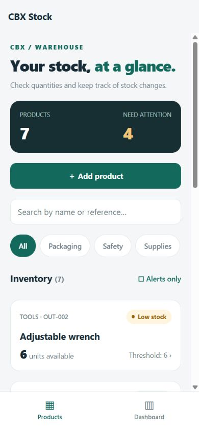
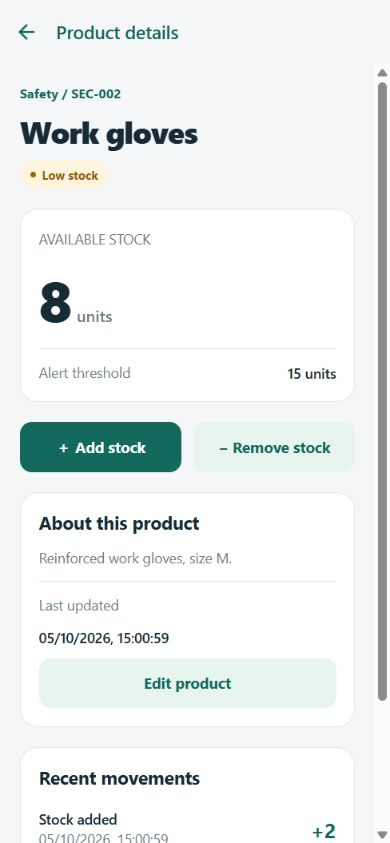
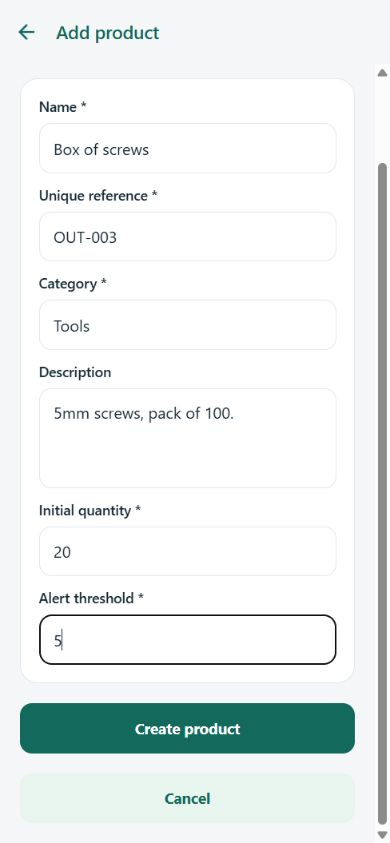
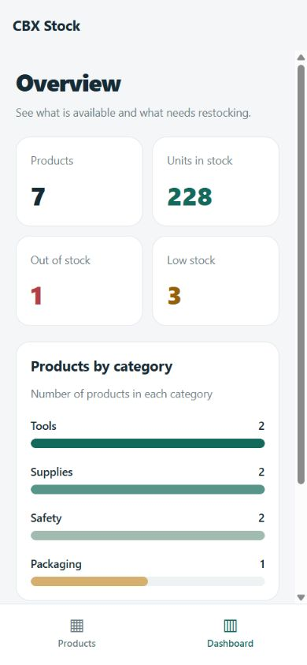

# Stock Management App

This is a small stock management app for the CBX mobile development exercise. You can add products, update their details and record stock coming in or going out. The list also shows which products need restocking.

Development note: AI assistance was used for both code and documentation. CBX asks for an exercise without AI-generated code, so this version does not meet that requirement unless they agree to accept it.

## Run the project

Install Node.js 24, then run:

```bash
git clone https://github.com/Shyamsundar0606/cbx-stock-management.git
cd cbx-stock-management
npm ci
npx expo start
```

The backend starts with the app on port 3000. The first time you run it, it creates the SQLite database and adds six products to try out. You do not need an `.env` file.

Press `w` to open the browser version, or scan the QR code with Expo Go compatible with SDK 57. Your phone and computer need to be on the same Wi-Fi. Press Ctrl+C to stop the app.

On Windows, stop the app before running `npm ci` again to avoid the `esbuild.exe` file-lock error. If your phone cannot load products, check firewall access for ports 3000 and 8081.

## Features

- Product list with search and category filters.
- Product details and an add/edit form.
- Stock entries, exits and movement history.
- Green, amber and red stock labels.
- Dashboard with totals and a category chart.

Normal stock is above the alert threshold. Low stock is above zero but at or below the threshold. Zero means out of stock.

The forms check that required fields are filled in and quantities are whole numbers, zero or above. Each product needs a unique reference. You cannot remove more units than are available.

## Technical choices

The app uses React Native with Expo and TypeScript. Expo makes it easy to run locally, and React Navigation handles the screens and bottom tabs. State is managed with React hooks because the app only has a few screens.

Express handles the API, and SQLite stores the products and stock movements. SQLite keeps installation simple because there is no separate database server to set up. A stock change and its history record are saved together in a transaction.

Versions: Node.js 24, Expo 57.0.26, React Native 0.86.3, React 19.2.3, TypeScript 6.0.3, React Navigation 7 and Express 5.2.1.

Mobile code is in `src/`. Backend code is in `backend/src/`, with tests in `backend/tests/`. Data is saved in `backend/data/stock.sqlite`, which is ignored by Git.

## API

Base URL: `http://localhost:3000/api`.

| Method | Endpoint | Purpose |
| --- | --- | --- |
| GET / POST | `/products` | List or create products |
| GET / PUT | `/products/:id` | Read or edit a product |
| GET / POST | `/products/:id/movements` | Read history or change stock |
| GET | `/dashboard` | Stock totals and categories |
| GET | `/health` | API status |

A stock entry uses `{ "direction": "in", "quantity": 5 }`. Use `"out"` for an exit.

## Screenshots

These show the earlier layout. The current version uses simpler panels and blue buttons.

 

 

## Checks and limitations

```bash
npm run lint
npm run check
npx expo export --platform all
```

The tests check invalid inputs, duplicate references, stock changes and two stock exits happening at the same time. They also check that data stays saved after restarting. The app has been tested in the browser, and Android and iOS bundles have been exported. It still needs testing on a phone or native simulator.

The dashboard bonus is included. Local notifications, login and offline mode are not implemented.
